<p align="center">
  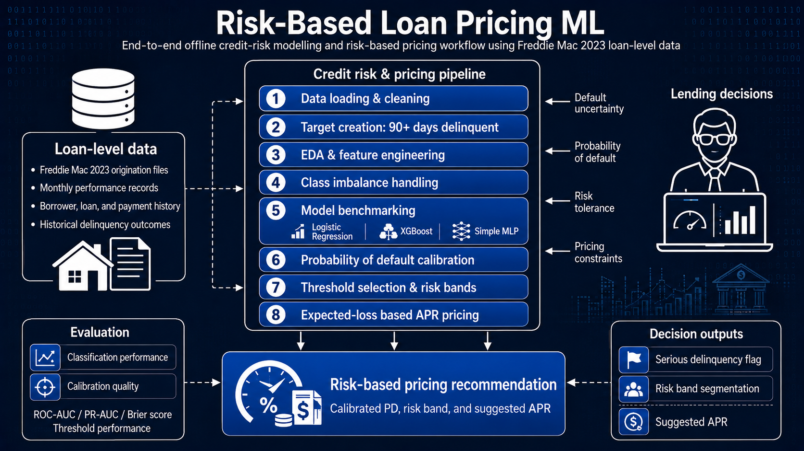
</p>

# Risk-Based Loan Pricing ML

**Author:** Telman Maghrebi  
**Role:** Data Scientist 

End-to-end credit-risk modelling and risk-based pricing project using real-world Freddie Mac loan-level performance data.

This project predicts whether a loan will become seriously delinquent, calibrates the predicted probability of default, assigns borrowers into interpretable risk bands, and converts credit risk into a suggested risk-based APR.

---

## Project Objective

The goal of this project is to build a practical machine learning workflow for credit-risk decisioning and risk-based pricing.

The project demonstrates:

- Credit-risk modelling
- Probability of default estimation
- Class imbalance handling
- Feature engineering
- Exploratory data analysis
- Logistic Regression with L1/L2 regularisation
- XGBoost challenger modelling
- Simple deep learning baseline
- Probability calibration
- Automatic threshold optimisation
- Risk-band segmentation
- Expected-loss based pricing

---

## Dataset

The project uses Freddie Mac Single-Family Loan-Level Dataset files for the 2023 vintage.

The processed dataset contains:

| Item | Value |
|---|---:|
| Loan origination records | 931,749 |
| Monthly performance records | 22,771,770 |
| Bad loans | 17,290 |
| Bad-loan rate | 1.86% |

A bad loan is defined as a loan that ever reaches **90+ days delinquent**.

---

## Project Workflow

```text
Raw Freddie Mac files
        ↓
Origination feature table
        ↓
Monthly performance target table
        ↓
Loan-level modelling dataset
        ↓
EDA and feature engineering
        ↓
Baseline and challenger models
        ↓
Probability calibration
        ↓
Automatic threshold selection
        ↓
Risk-band segmentation
        ↓
Expected-loss pricing engine
```

---

## Exploratory Data Analysis

### Target Distribution

The dataset is highly imbalanced, with bad loans representing only 1.86% of the total portfolio.

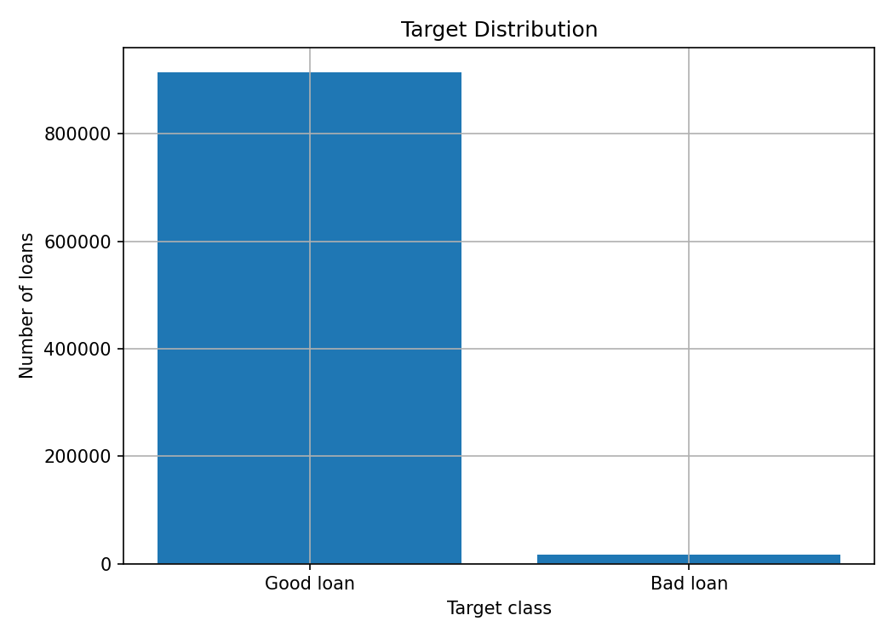

---

### Numerical Feature Correlation

A Pearson correlation heatmap was created for numerical features. Highly collinear variables were removed before modelling.

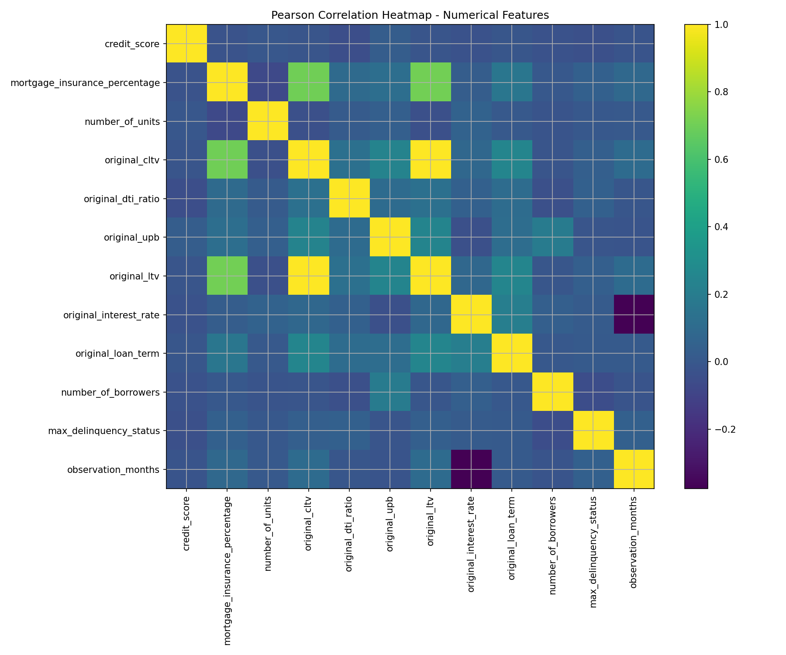

High-correlation numerical pairs were saved to:

```text
reports/high_correlation_numeric_pairs.csv
```

Spearman correlation pairs were also saved to:

```text
reports/nonlinear_spearman_numeric_pairs_all.csv
```

---

### Cross Plots for Highly Correlated Features

Scatter plots were generated for numerical feature pairs with high Pearson correlation.

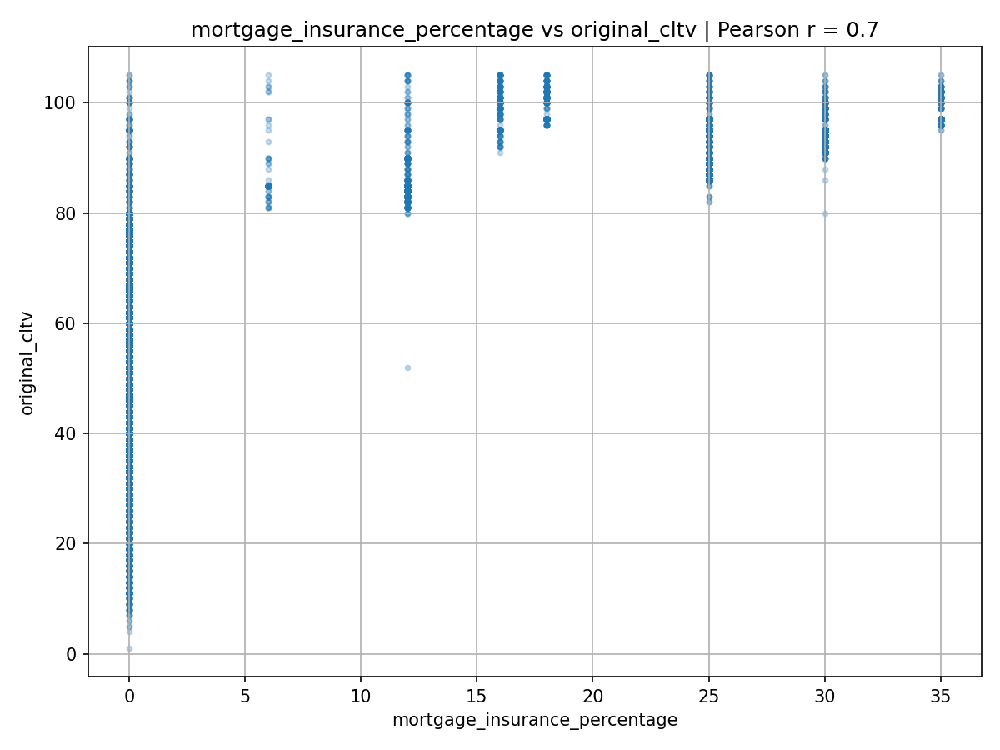

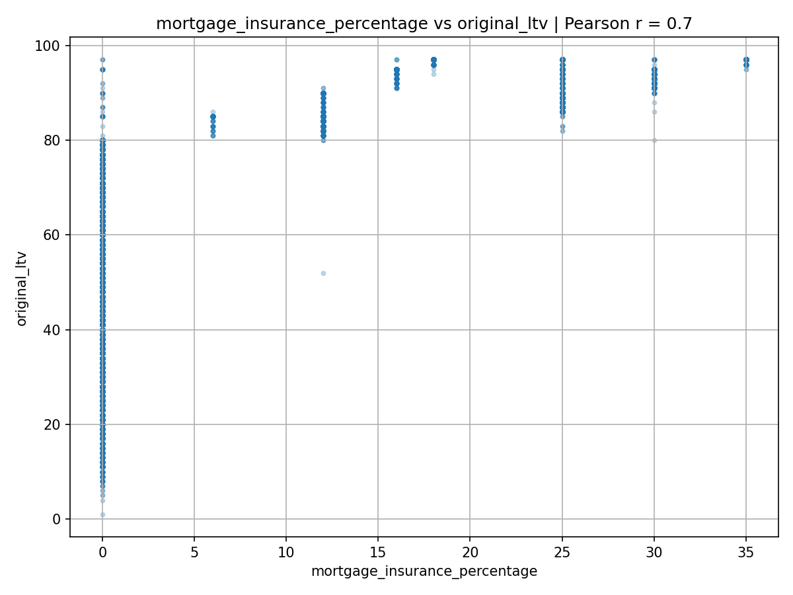

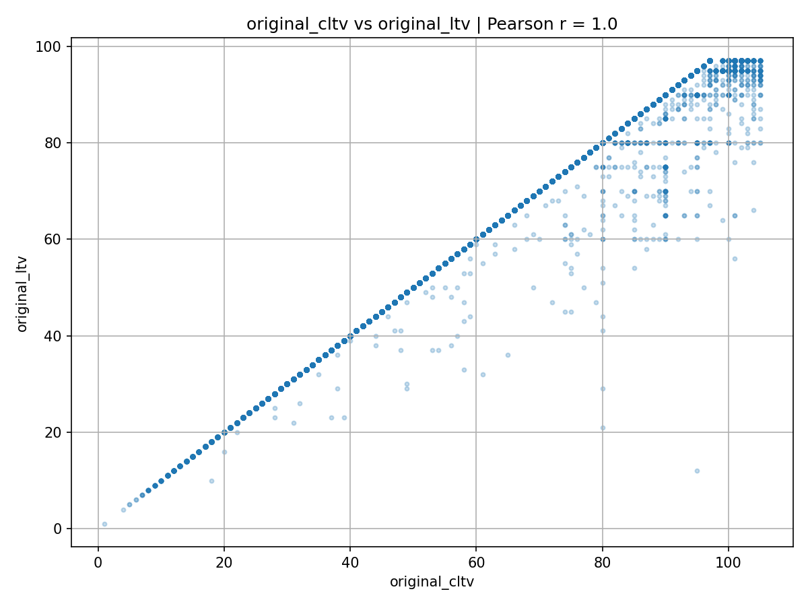

---

## Feature Engineering

The feature-engineering process includes:

1. Removing leakage columns from monthly performance history
2. Removing highly collinear numerical variables
3. Removing categorical variables with only one class
4. Removing high-cardinality categorical variables
5. One-hot encoding categorical variables
6. Handling class imbalance through undersampling
7. Splitting data into train, calibration and test sets

### Removed Collinear Numerical Features

| Kept feature | Dropped feature | Absolute Pearson correlation |
|---|---|---:|
| mortgage_insurance_percentage | original_cltv | 0.70 |
| mortgage_insurance_percentage | original_ltv | 0.70 |
| original_cltv | original_ltv | 1.00 |

### Removed Categorical Features

| Feature | Reason | Unique values |
|---|---|---:|
| prepayment_penalty_mortgage_flag | only one class | 1 |
| amortization_type | only one class | 1 |
| interest_only_indicator | only one class | 1 |
| msa | high cardinality | 435 |
| postal_code | high cardinality | 888 |

---

## Class Imbalance

The target is highly imbalanced.

Original training distribution:

| Class | Count | Share |
|---|---:|---:|
| Good loan | 731,567 | 98.14% |
| Bad loan | 13,832 | 1.86% |

After undersampling:

| Class | Count | Share |
|---|---:|---:|
| Good loan | 41,496 | 75.00% |
| Bad loan | 13,832 | 25.00% |

Undersampling was used only on the training data. Evaluation was performed on the original imbalanced test set.

---

## Model Results

Three models were compared:

| Model | Type | ROC-AUC | PR-AUC | Role |
|---|---|---:|---:|---|
| XGBoost | Tree-based challenger | 0.8248 | 0.1313 | Best-performing model |
| Simple MLP | Deep learning challenger | 0.8213 | 0.1161 | Tested neural-network baseline |
| Logistic Regression L1 | Interpretable baseline | 0.8165 | 0.1130 | Scorecard-style benchmark |

The dataset is highly imbalanced, so **PR-AUC** was treated as the main model-selection metric.

XGBoost improved PR-AUC by approximately 16% compared with Logistic Regression:

```text
(0.1313 - 0.1130) / 0.1130 = 16.2%
```

---

## Logistic Regression Baseline

Logistic Regression was used as an interpretable scorecard-style benchmark.

L1 and L2 regularisation were compared:

| Model | Validation ROC-AUC | Validation PR-AUC |
|---|---:|---:|
| Logistic Regression L1 | 0.8227 | 0.1117 |
| Logistic Regression L2 | 0.8227 | 0.1114 |

L1 was selected because it achieved slightly better PR-AUC and supports sparse, interpretable feature selection.

---

## Logistic Regression Threshold Selection

The automatic threshold-selection rule was:

> Maximise bad-loan recall while keeping approval rate at or above 80%.

Selected calibrated PD threshold:

| Metric | Value |
|---|---:|
| Threshold | 3.00% |
| Approval rate | 81.63% |
| Decline / refer rate | 18.37% |
| Precision | 6.31% |
| Bad-loan recall | 62.52% |
| False positive rate | 17.54% |

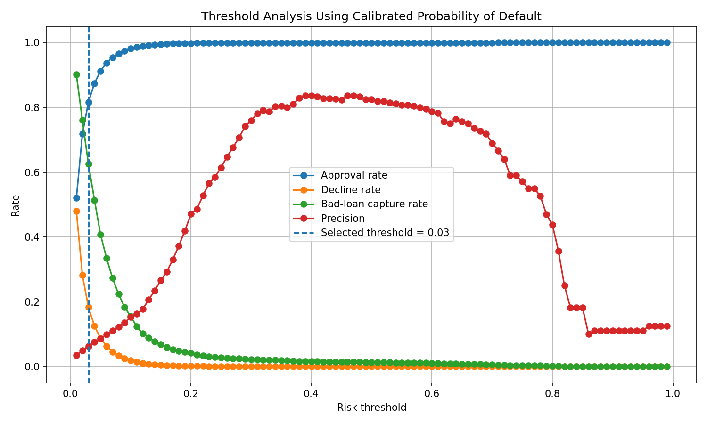

---

## Logistic Regression Risk Bands

| Risk band | Loan share | Actual bad rate | Average calibrated PD |
|---|---:|---:|---:|
| Low risk | 63.96% | 0.49% | 0.59% |
| Medium risk | 17.67% | 2.17% | 2.13% |
| High risk | 18.37% | 6.31% | 6.08% |

The high-risk band is around 3.4x riskier than the total portfolio average and around 12.9x riskier than the low-risk band.

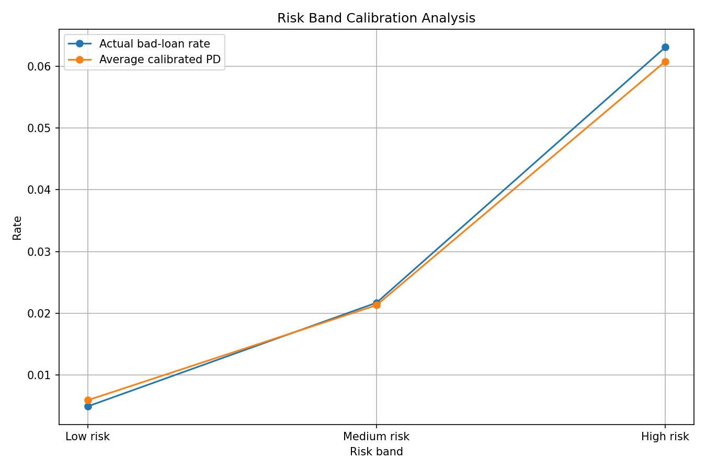

---

## Logistic Regression Risk-Based Pricing

The pricing engine uses:

```text
Expected Loss = PD × LGD
Suggested APR = Funding Cost + Operating Cost + Profit Margin + Expected Loss
```

Assumptions:

| Component | Value |
|---|---:|
| Loss given default | 40% |
| Funding cost | 4% |
| Operating cost | 2% |
| Profit margin | 3% |

Pricing output by risk band:

| Risk band | Average PD | Average expected loss | Average suggested APR |
|---|---:|---:|---:|
| Low risk | 0.59% | 0.24% | 9.24% |
| Medium risk | 2.13% | 0.85% | 9.85% |
| High risk | 6.08% | 2.43% | 11.43% |

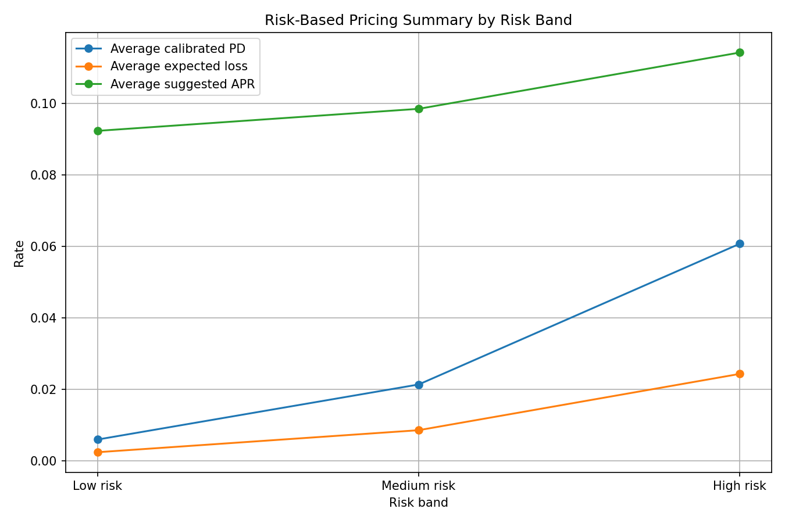

---

## XGBoost Challenger Model

XGBoost was the best-performing model by PR-AUC.

| Metric | Value |
|---|---:|
| ROC-AUC | 0.8248 |
| PR-AUC | 0.1313 |

XGBoost improved ranking performance compared with Logistic Regression and captured stronger non-linear relationships in borrower and loan origination features.

---

## XGBoost Threshold Selection

The same automatic threshold-selection rule was applied:

> Maximise bad-loan recall while keeping approval rate at or above 80%.

Selected calibrated PD threshold:

| Metric | Value |
|---|---:|
| Threshold | 2.40% |
| Approval rate | 80.36% |
| Decline / refer rate | 19.64% |
| Precision | 6.22% |
| Bad-loan recall | 65.88% |
| False positive rate | 18.76% |

Compared with Logistic Regression, XGBoost captured 116 additional bad loans under the same approval-rate constraint.

```text
2,278 - 2,162 = 116 additional bad loans captured
```

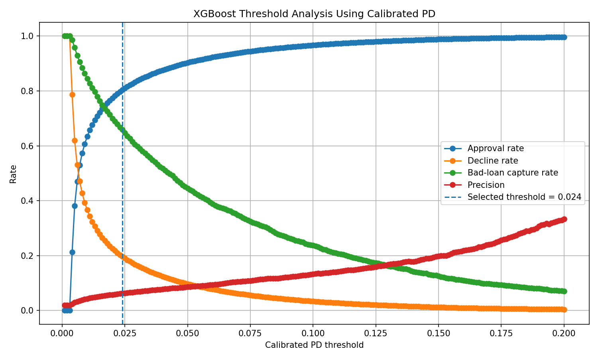

---

## XGBoost Risk Bands

| Risk band | Loans | Loan share | Actual bad rate | Average calibrated PD |
|---|---:|---:|---:|---:|
| Low risk | 126,044 | 67.64% | 0.52% | 0.55% |
| Medium risk | 23,709 | 12.72% | 2.24% | 1.70% |
| High risk | 36,597 | 19.64% | 6.22% | 6.56% |

XGBoost creates clear separation between low, medium and high-risk groups.

---

## XGBoost Risk-Based Pricing Output

| Risk band | Loans | Actual bad rate | Average PD | Expected loss | Suggested APR |
|---|---:|---:|---:|---:|---:|
| Low risk | 126,044 | 0.52% | 0.55% | 0.22% | 9.22% |
| Medium risk | 23,709 | 2.24% | 1.70% | 0.68% | 9.68% |
| High risk | 36,597 | 6.22% | 6.56% | 2.62% | 11.62% |

The XGBoost model produces a wider pricing spread than Logistic Regression and is selected as the strongest challenger model for risk-based pricing.

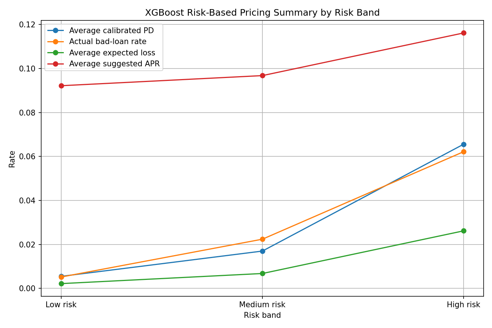

---

## Business Interpretation

The project shows how borrower and loan origination features can be transformed into a practical credit-risk decisioning workflow.

The final workflow supports:

- Identifying high-risk loans
- Ranking applicants by calibrated probability of default
- Assigning interpretable risk bands
- Applying threshold rules based on approval-rate constraints
- Converting PD into expected loss
- Producing risk-sensitive APR recommendations

This maps directly to real-world underwriting and risk-based pricing use cases.

---

## Project Structure

```text
risk-based-loan-pricing-ml/
│
├── data/
│   ├── raw/
│   └── processed/
│
├── reports/
│   ├── figures/
│   │   ├── eda/
│   │   └── model/
│   ├── threshold_analysis.csv
│   ├── selected_threshold.csv
│   ├── risk_band_analysis.csv
│   ├── pricing_decisions.csv
│   ├── challenger_model_comparison.csv
│   ├── final_model_comparison.csv
│   ├── xgboost_threshold_analysis.csv
│   ├── xgboost_selected_threshold.csv
│   ├── xgboost_risk_band_analysis.csv
│   ├── xgboost_pricing_decisions.csv
│   └── xgboost_pricing_summary_by_risk_band.csv
│
├── src/
│   ├── freddie_schema.py
│   ├── inspect_freddie_files.py
│   ├── count_freddie_rows.py
│   ├── inspect_freddie_target.py
│   ├── build_freddie_target.py
│   ├── build_freddie_features.py
│   ├── build_model_dataset.py
│   ├── eda_freddie.py
│   ├── train_logistic_regression.py
│   ├── threshold_analysis.py
│   ├── risk_band_analysis.py
│   ├── pricing_engine.py
│   ├── train_challenger_models.py
│   ├── train_xgboost_calibrated.py
│   ├── xgboost_threshold_analysis.py
│   ├── xgboost_risk_band_analysis.py
│   ├── xgboost_pricing_engine.py
│   ├── plot_pricing_summary.py
│   └── plot_xgboost_pricing_summary.py
│
├── requirements.txt
├── .gitignore
└── README.md
```

---

## How to Run

Create and activate a virtual environment:

```powershell
python -m venv .venv
.\.venv\Scripts\Activate.ps1
```

Install dependencies:

```powershell
pip install -r requirements.txt
```

Build the modelling dataset:

```powershell
python src\build_freddie_target.py
python src\build_freddie_features.py
python src\build_model_dataset.py
```

Run EDA:

```powershell
python src\eda_freddie.py
```

Train Logistic Regression:

```powershell
python src\train_logistic_regression.py
python src\threshold_analysis.py
python src\risk_band_analysis.py
python src\pricing_engine.py
```

Train challenger models:

```powershell
python src\train_challenger_models.py
```

Train and price with XGBoost:

```powershell
python src\train_xgboost_calibrated.py
python src\xgboost_threshold_analysis.py
python src\xgboost_risk_band_analysis.py
python src\xgboost_pricing_engine.py
python src\plot_xgboost_pricing_summary.py
```

---

## Notes

The model is intentionally structured like a practical credit-risk workflow.

Logistic Regression is used as a transparent scorecard-style baseline.

XGBoost is used as a stronger challenger model for improved ranking performance.

The simple MLP model was tested as a deep learning baseline, but it did not outperform XGBoost on this structured tabular dataset.

---

## Future Improvements

Planned improvements:

- Add SHAP-based reason codes
- Add model drift monitoring
- Add population stability index
- Add champion/challenger monitoring
- Add Streamlit pricing dashboard
- Add reject inference discussion
- Add macroeconomic features
- Add time-based validation
- Add fairness and bias analysis